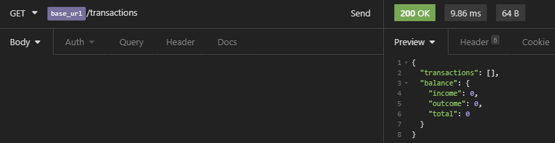
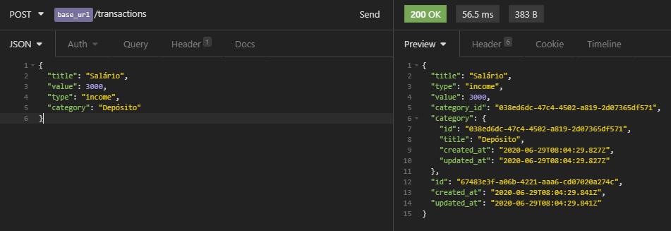
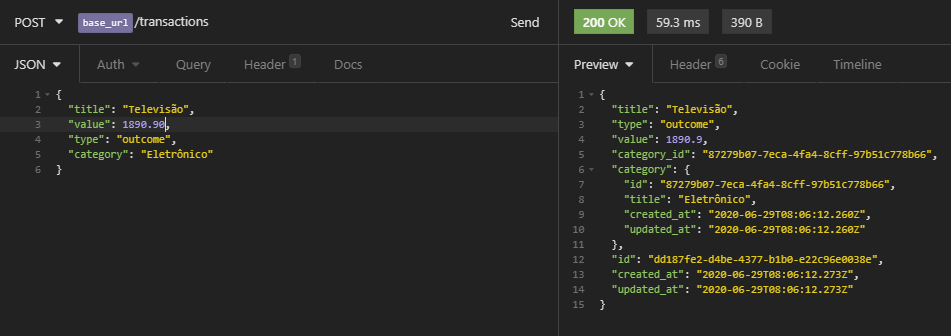
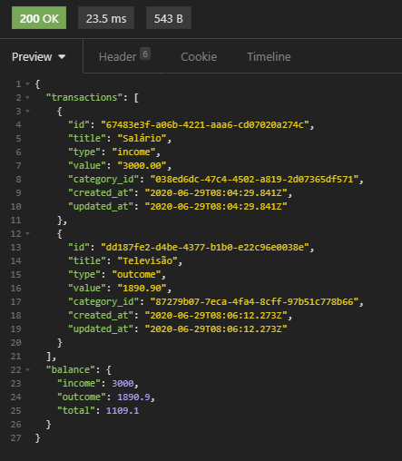
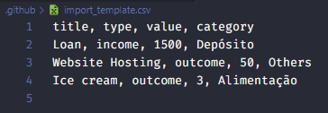
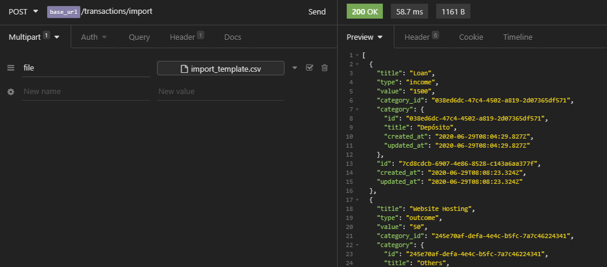
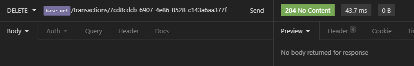
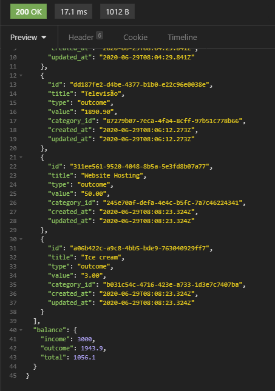

    

    
    
    
    
    
    
    
    
    

  <a href="#-Sobre-o-desafio">🚀 Sobre o desafio</a>&nbsp;&nbsp;&nbsp;|&nbsp;&nbsp;&nbsp;
  <a href="#-Projeto">🚧 Projeto</a>

# 🚀 Sobre o desafio

Nesse desafio, você deve continuar desenvolvendo a aplicação de gestão de transações, treinando o que você aprendeu até agora no Node.js junto ao TypeScript, mas dessa vez incluindo o uso de banco de dados com o TypeORM e envio de arquivos com o Multer!

Essa será uma aplicação que deve armazenar transações financeiras de entrada e saída e permitir o cadastro e a listagem dessas transações, além de permitir a criação de novos registros no banco de dados a partir do envio de um arquivo csv.

# 🚧 Projeto

    
Utilizando insomnia para ter uma resposta visual:  

    
⚪ Arquivo <strong>CSV</strong>.

    
🟣 Requisição GET.

    
🟢 Requisição POST.

    
🔴 Requisição DELETE.  

    
🟣 Inicialmente é feita uma requisição GET á API, como não ha dados no <strong>Banco de Dados</strong> a lista fica vazia e com o <i>balance</i> zerado. 

    
    
🟢 Requisição POST realizada em seguida, fazendo um depósito (<i>income</i>) de <i>value</i> 3000.

    
    
🟢 Requisição POST realizada em seguida, fazendo uma operação de pagamento exemplo de uma televisão, (<i>outcome</i>) de <i>value</i> 1890.90.

    
    
🟣 Requisição GET mostrando todas <i>transactions</i> cadastradas, ja realizando o <i>balance</i>.

    
    
⚪ Arquivo <strong>import_template.csv</strong>, utilizado para exemplo, na próxima figura.

    
    
🟢 Requisição POST fazendo a importação do arquivo .csv acima.

    
    
🟣 Requisição GET mostrando todas <i>transactions</i> cadastradas, ja realizando o <i>balance</i> e com a importação do arquivo .csv. 🔴 ID em destaque selecionado apenas para exemplificar a rota DELETE.

    
    
🔴 Requisição DELETE.

    
    
🟣 Requisição GET, fazendo a ultima listagem para mostra como ficou depois de todas as requisições.

    

---

Desenvolvido com 💚 por [Felipe Zanetti!](https://www.linkedin.com/in/felipezanetti/)
